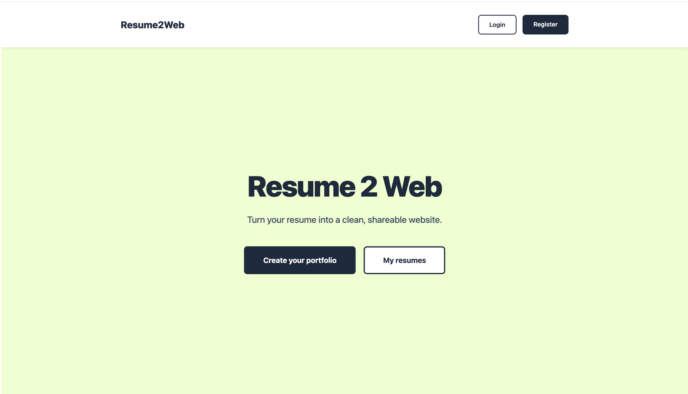
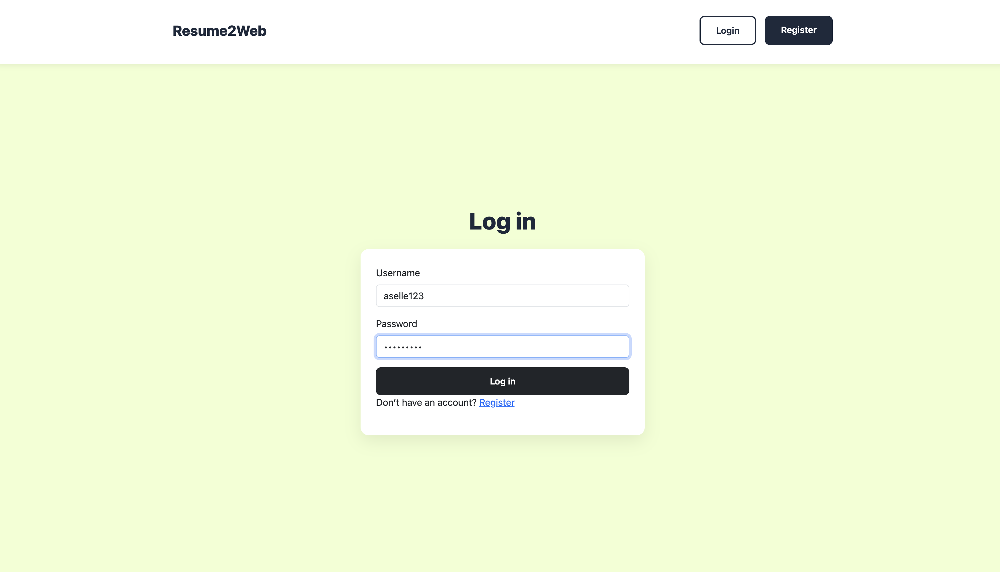
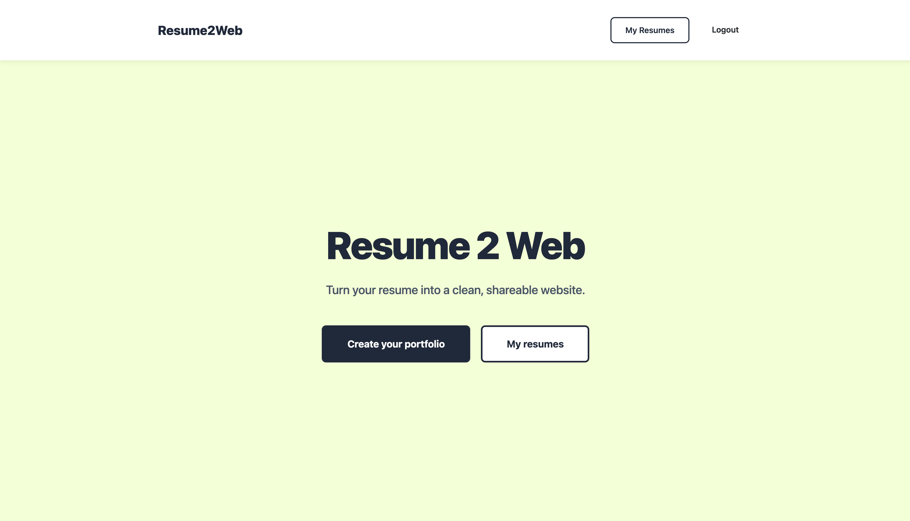
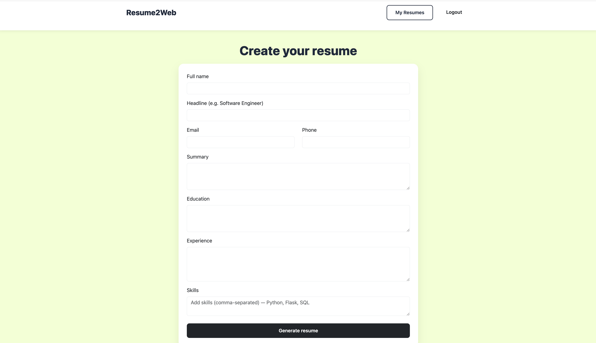
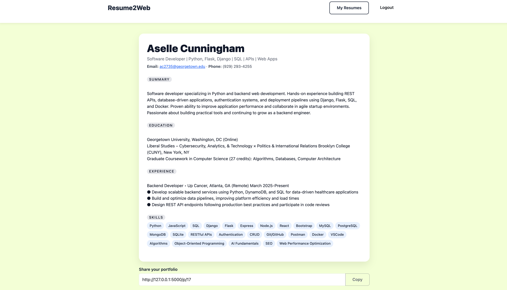
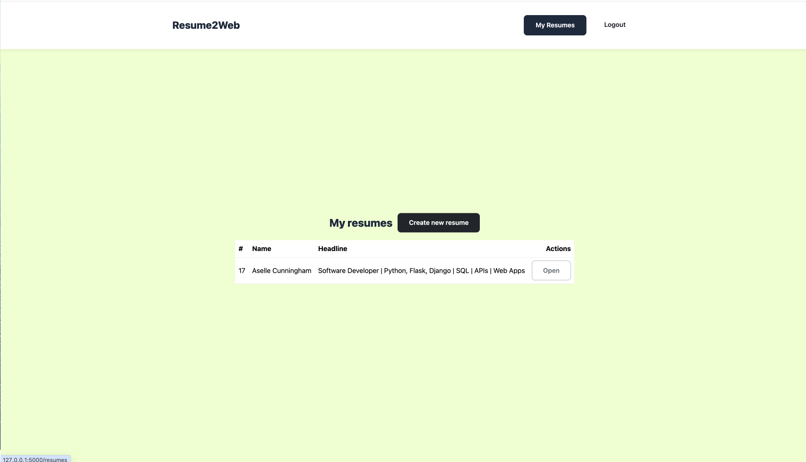
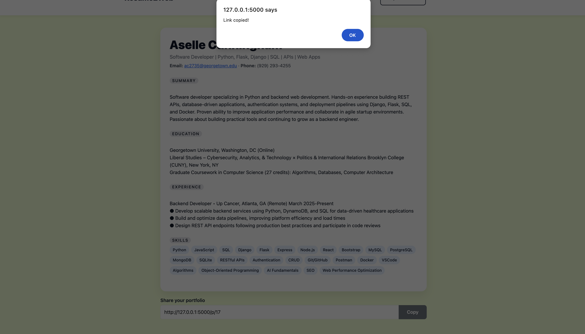
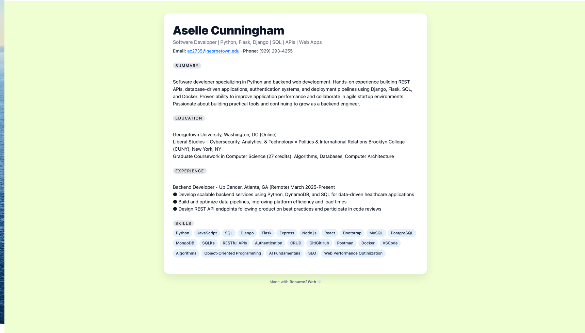

---

# 📄 Resume2Web — Turn Your Résumé Into a Shareable Portfolio

#### Video Demo: `https://www.youtube.com/watch?v=okyh8sM6wwY`

#### Author: **Aselle Cunningham**











# 
# 
# 
# 
# 
# 
# 

---

## 🎯 Overview

**Resume2Web** is a web application that helps users turn a simple résumé into a clean, public-facing portfolio website.

The idea came from wanting something practical and fast: most people have résumés, but not everyone has time or tools to build a personal site. This app bridges that gap.

Users can:

* create an account
* enter their résumé details
* generate a portfolio page
* share a public link that stays live (hosted on Render)

The application was first developed inside the CS50 Codespace, then migrated to my local machine, version-controlled with Git, and finally deployed as a live Flask app using Render.

---

## 🧭 App Flow

1. User registers
2. Creates a résumé
3. Views it in dashboard
4. Copies the public link
5. Shares it anywhere


## ✨ Features

### 👤 User Accounts

* Register and log in with username + password
* Passwords stored securely using hashed values
* Sessions managed with Flask-Session

### 📝 Build Your Résumé

Users fill out a form with fields like:

* name
* headline
* email and phone
* summary
* education
* experience
* skills

Data is stored in SQLite.

### 🌐 Generate a Portfolio

Each résumé automatically becomes a clean portfolio page.

There are two different views:

1️⃣ **Dashboard View** – private (only logged-in users)

2️⃣ **Public View** – shareable portfolio  
   No navbar, no editing controls, just the résumé.


Example structure:

```
🔒 `/resume/5` → private dashboard view  
🌍 `/p/5` → public portfolio link
```

### 🔗 Shareable Links

Each portfolio has a stable URL.
Users can copy their link and send it anywhere.

### 🎨 Reusable Template Components

To avoid duplicating HTML, I used a partial template:

```
resume_body.html
```

That same résumé layout is included in both:

* dashboard version
* public version

This helped separate presentation from UI logic — something emphasized in CS50.

---

## 🛠️ Technologies Used

| Tool                 | Purpose                    |
| -------------------- | -------------------------- |
| **Python / Flask**   | Web framework              |
| **SQLite**           | Database                   |
| **Flask-Session**    | User sessions              |
| **Werkzeug**         | Password hashing           |
| **CS50 SQL library** | Simplified database access |
| **Bootstrap**        | Base grid + form helpers   |
| **Custom CSS**       | Core UI design             |
| **Gunicorn**         | Production server          |
| **Render**           | Hosting                    |


---

## 🗄️ Database Design

Two key tables:

### `users`

```
id INTEGER PRIMARY KEY
username TEXT UNIQUE NOT NULL
hash TEXT NOT NULL
```

### `resumes`

```
id INTEGER PRIMARY KEY
user_id INTEGER NOT NULL
full_name TEXT
headline TEXT
email TEXT
phone TEXT
summary TEXT
education TEXT
experience TEXT
skills TEXT
FOREIGN KEY(user_id) REFERENCES users(id)
```


This follows CS50 finance-style design:
each resume belongs to the user who created it.

---

## 🚀 Deployment Journey

This project started in the **CS50 online IDE**, where I built the core logic and database design.

Then I:

1. copied the project to my local machine
2. set up a Python virtual environment
3. initialized Git and pushed the code to GitHub
4. created a Render web service connected to the GitHub repo
5. configured environment variables like `SECRET_KEY`
6. deployed using:

```
Build: pip install -r requirements.txt
Start: gunicorn app:app
```

Render now runs the app live, and users can access shareable portfolio links even when my local environment is offline.

---

## 🤖 AI Assistance Acknowledgment

Per CS50 policy:
I used AI tools (including ChatGPT) as helpers while building this project — mainly for:

* brainstorming design decisions
* debugging tricky Flask/SQL issues
* improving UI/UX wording
* learning best practices (sessions, templates, deployment)
* drafting README text, which I edited myself

All final logic, structure, and implementation decisions were my own.

---

## 🔍 What I Learned

This project reinforced almost every core CS50 concept:

* working with relational databases
* structuring Python web apps
* server-side rendering with Jinja
* authentication and sessions
* safe password storage
* HTTP routes
* version control
* deploying applications professionally

More importantly, I learned how to go from **course exercise → real usable tool**.

---

## 🔮 Future Improvements

Some features I’d like to add:

* custom URLs like `/p/john-doe`
* resume privacy controls
* file uploads for profile photos
* multiple portfolio themes
* downloadable PDF export
* email invitation link sharing

---

## 📌 How to Run Locally

```
python3 -m venv venv
source venv/bin/activate
pip install -r requirements.txt
python app.py
```

App runs at:

```
http://127.0.0.1:5000 # locally
https://projectcs50-95dr.onrender.com/ # deployed
```

